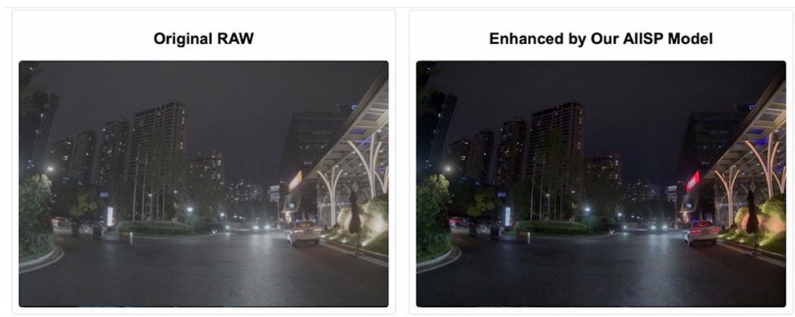

# Image-Enhancement-Based-Auto-ISP-Tuning

This repository provides a RawFormer-based AI-ISP prototype for automotive RAW image enhancement. It maps single-channel Bayer RAW inputs to enhanced RGB outputs using a Conv-Transformer hybrid architecture and RepNR-based noise modeling modules.

The project focuses on low-light RAW enhancement, noise suppression, and cross-sensor robustness for automotive imaging scenarios.

本项目是一个面向车载 RAW 图像增强场景的 AI-ISP 原型实现。项目以 RawFormer 为基础模型，结合 Conv-Transformer 混合结构和 RepNR 噪声抑制模块，将单通道 Bayer RAW 输入直接映射为三通道 RGB 增强结果。项目主要目标是替代传统 ISP 中依赖手工调参的多级流水线，在低光、噪声和跨传感器场景下获得更稳定的图像质量。

> 注意：本项目使用的数据集归 Freetech 所有，不随仓库提供。README 中只说明数据目录格式和运行方式，不包含数据下载链接。

## Quick Start

Before running training or demo scripts, please prepare the dataset or checkpoint according to the following sections.

```bash
git clone https://github.com/Jason-zzh/Image-Enhancement-Based-Auto-ISP-Tuning.git
cd Image-Enhancement-Based-Auto-ISP-Tuning

pip install -r requirements.txt
pip install opencv-python flask tensorboard

# prepare Freetech-style RAW/RGB pairs under ./freetech_dataset
python train_freetech.py

# run web demo
python app_freetech.py
```

## 项目特点

- 端到端 RAW 图像增强：输入单通道 RAW，输出 RGB 图像。
- RawFormer 主干：采用 U-Net 式 encoder-decoder，多尺度提取和恢复图像细节。
- Conv-Transformer 模块：卷积分支负责局部纹理和边缘，Transformer 分支建模全局上下文和通道依赖。
- Restormer 风格注意力：使用 `C x C` 的 transposed self-attention，降低高分辨率图像上的注意力计算压力。
- RepNR 噪声建模：在 Freetech 版本中引入 CSA、IMNR、OMNR，用于相机域适配和噪声残差补偿。
- 工程入口完整：包含训练脚本、数据加载脚本、离线推理脚本、Web 上传增强 demo 和视频流增强 demo。

## 模型概览

基础模型位于 `model.py`，Freetech 改进版位于 `model_freetech.py`。

RawFormer 主流程：

```text
RAW input [B, 1, H, W]
  -> downshuffle / PixelUnshuffle
  -> 3x3 embedding convolution
  -> encoder: Conv_Transformer + Downsample x 3
  -> bottleneck: Conv_Transformer
  -> decoder: upsample + skip connection + Conv_Transformer x 3
  -> output convolution
  -> PixelShuffle
RGB output [B, 3, H, W]
```

`Conv_Transformer` 使用双分支结构：

```text
input feature
  -> convolution branch: 3x3 Conv + LeakyReLU
  -> transformer branch: LayerNorm + channel attention + convolutional FFN
  -> concat
  -> 1x1 channel reduction
  -> 3x3 feature refinement
```

Freetech 版本在该模块中加入 `RepNRBlock`：

- `CSALayer`：为不同虚拟相机学习独立的通道缩放和偏置，减弱不同传感器 RAW 分布差异。
- `IMNRLayer`：对经过相机适配后的特征进行主要噪声建模。
- `OMNRLayer`：零初始化的残差补偿分支，从原始特征中学习额外修正。
- `reparameterize()`：预留训练期多分支到推理期单分支融合的接口。

## 文件结构

```text
.
|-- model.py                    # 基础 RawFormer 模型
|-- model_freetech.py           # 加入 RepNR 的 Freetech 改进版模型
|-- load_dataset.py             # SID / MCR 数据加载
|-- load_dataset_freetch.py     # Freetech RAW-RGB 配对数据加载
|-- train.py                    # 基础 RawFormer 训练入口
|-- train_freetech.py           # Freetech 数据训练入口
|-- test.py                     # SID / MCR 测试入口
|-- app_freetech.py             # Flask Web 上传增强 demo
|-- media.py                    # 实时视频流增强 demo
|-- calc_psnr.py                # 简单 PSNR 计算脚本
|-- warmup_scheduler.py         # warmup 学习率调度器
|-- requirements.txt            # 部分 Python 依赖
|-- LICENSE                     # MIT 开源许可证
|-- .gitignore                  # Git 忽略规则
|-- .gitattributes              # 文本/二进制文件规则
|-- templates/                  # Web demo 页面模板
|-- static/                     # Web demo 静态资源和输出图像
`-- uploads/                    # Web demo 上传文件目录
```

`load_dataset_freetch.py` keeps the original filename used during development. The dataset and company name are referred to as Freetech throughout this README.

## 环境配置

建议使用 Python 3.9+ 和支持 CUDA 的 PyTorch 环境。训练高分辨率 RAW 图像时显存占用较大，建议使用独立 GPU。

安装 PyTorch 请根据本机 CUDA 版本选择官方命令。例如：

```bash
pip install torch torchvision --index-url https://download.pytorch.org/whl/cu121
```

安装项目依赖：

```bash
pip install -r requirements.txt
pip install opencv-python flask tensorboard
```

如果需要读取 `.ARW` / `.DNG` 等标准相机 RAW 文件，需确保 `rawpy` 可正常安装和导入。

## Freetech 数据集

Freetech 数据集不随项目公开。训练脚本默认查找以下目录：

```text
freetech_dataset/
|-- RAW/
|   |-- sample_001.raw
|   `-- sample_002.raw
`-- RGB/
    |-- sample_001.rgb 或 sample_001.bmp
    `-- sample_002.rgb 或 sample_002.bmp
```

Expected input:

- RAW shape: `1920 x 1280`
- RAW format: single-channel Bayer, `uint16`
- RGB target: paired image with the same basename

配对规则：

- `RAW/` 中的 `.raw` 文件和 `RGB/` 中同名 `.rgb` 或 `.bmp` 文件自动配对。
- 默认 RAW 分辨率为 `1920 x 1280`。
- 默认 RAW 数据类型为 `uint16`。
- 默认 RAW header size 为 `0`。
- 默认预处理为黑电平校正和归一化：

```python
raw_processed = (np.maximum(raw - 512, 0) / (16383 - 512)) * 100
```

If your RAW files use a different Bayer pattern, bit depth, black level, or resolution, modify the corresponding constants in `load_dataset_freetch.py`, `app_freetech.py`, and `media.py`.

## 训练 Freetech 模型

主训练入口为：

```bash
python train_freetech.py
```

默认配置位于 `train_freetech.py`：

- 数据路径：`./freetech_dataset`
- batch size：`16`
- patch size：`512`
- model size：`S`，对应 `dim=32`
- epoch：`1000`
- 输出目录：`result/Freetech/`

训练输出：

```text
result/Freetech/
|-- weights/    # model_best.pth 和最终 checkpoint
|-- images/     # 测试输出图像
|-- csv/        # 指标结果
`-- logs/       # TensorBoard 日志
```

如果要从已有 checkpoint 继续训练，请将权重放到：

```text
result/Freetech/weights/model_best.pth
```

并确认脚本中的 `use_pretrain`、`pretrain_weights`、`pretrain_mode` 设置符合当前实验阶段。

## Web Demo

`app_freetech.py` 提供一个简单的 Flask 上传增强页面，默认加载：

```text
./model_best.pth
```

运行：

```bash
python app_freetech.py
```

然后访问：

```text
http://localhost:5002
```

页面支持上传 `.raw`、`.arw`、`.dng` 文件，并显示传统预览和模型增强结果。当前 demo 默认按自定义 `.raw` 格式处理，分辨率为 `1920 x 1280`，Bayer pattern 使用 `BGGR`。如使用标准 `.ARW` / `.DNG` 文件，需要补充或调整 `rawpy` 读取逻辑。

## 实时视频流 Demo

`media.py` 提供实时流增强原型，默认从 UDP 地址读取视频流：

```text
udp://192.168.2.1:5000
```

运行：

```bash
python media.py
```

访问：

```text
http://localhost:5002
```

该脚本会启动采集线程和增强线程，并以 MJPEG 形式分别输出原始画面和增强画面。当前实现仍是工程原型，若输入源不是 RAW Bayer 数据，需要根据实际板端输出格式调整 `load_single_custom_raw_from_bytes()`。

## Baseline 脚本

仓库保留了原始 RawFormer 的 SID / MCR 训练与测试逻辑：

```bash
python train.py
python test.py
```

这些脚本使用 `model.py` 和 `load_dataset.py`，路径中包含原实验环境下的 SID / MCR 数据目录。若要复现实验，需要自行准备对应公开数据集并修改路径。

## 结果图对比

下图展示了同一帧低光 RAW 输入经过传统 ISP 预览和 RawFormer AI-ISP 增强后的效果对比。



## 指标与验证

项目中使用的主要评价指标包括：

- PSNR：像素级重建质量。
- SSIM：结构相似性。
- LPIPS：感知质量，论文中用于验证低光和复杂场景表现。
- White-Balance Error：颜色/白平衡偏差。
- 模型大小与峰值内存：用于评估嵌入式部署可行性。

以下指标来自内部 Freetech 验证集，仅用于说明当前工程版本的实验结果。由于 Freetech 数据集不公开，这些数值不能直接通过本仓库复现。

该工程实现 PSNR 31.76 dB、SSIM 0.934、LPIPS 0.072，并关注跨传感器性能下降、低光鲁棒性和嵌入式部署成本。当前仓库主要提供 PyTorch 训练和 demo 实现，部署到具体 NPU 平台仍需要额外导出、量化和板端适配工作。

## License

This project is released under the MIT License. See `LICENSE` for details.

The source code can be used, modified, and redistributed under the terms of the MIT License. The Freetech dataset, trained weights derived from private data, and any third-party datasets are not included in this license grant unless separately authorized by their owners.

This repository does not redistribute private data or trained weights derived from private data.

## Limitations and TODO

- Freetech 数据集和训练权重不随仓库提供。
- Dataset paths and RAW parameters are currently hard-coded in several scripts.
- `requirements.txt` 只列出了部分依赖，运行训练和 demo 还需要 PyTorch、OpenCV、Flask、TensorBoard 等。
- 当前 `model_freetech.py` 中 `reparameterize()` 是预留接口，训练脚本没有完整执行模型结构融合导出。
- NPU deployment, quantization, and board-side adaptation are not included.
- Web 和视频流脚本中的分辨率、header size、bit depth、Bayer pattern 都是按当前 Freetech 样例设置的工程参数，迁移到新设备时需要重新确认。

## Acknowledgement

This project is built upon ideas from RawFormer and related low-light image enhancement / reparameterized noise reduction methods. We thank the authors of the original works for their contributions.

- RawFormer baseline: end-to-end RAW image restoration and enhancement.
- LED / RepNR: low-light enhancement and reparameterized noise reduction.
